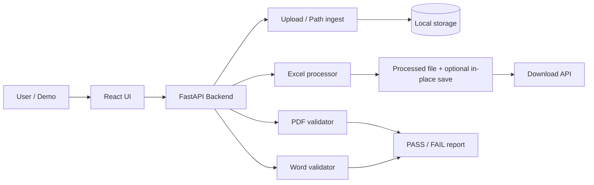

# Document Processing POC — Manager Demo (PPT Content)

Copy each section into PowerPoint slides. Speaker notes are under **Notes** where provided.

---

## Slide 1 — Title

**Document Processing POC — Demo & Findings**

- Presenter: [Your name]
- Date: [Demo date]
- Tagline: *Proof that we can ingest, validate, and modify Excel, Word, and PDF at scale*

**Notes:** Open with one sentence: “This POC de-risks automating our document workflows before we commit to production build.”

---

## Slide 2 — Why we ran this POC

**Goal:** De-risk automating document workflows before production investment.

| Question we needed answered | POC answer |
|----------------------------|------------|
| Can we **read and modify Excel** without breaking layouts/formulas? | Yes — append/update columns, conditional highlighting, extra worksheet |
| Can we **read PDF & Word** for compliance/content checks? | Yes — text extraction + configurable PASS/FAIL rules |
| Do **large files** behave acceptably? | Yes — validated on representative large workbooks/documents in testing |
| Can we work from a **known server path** (not only browser upload)? | Yes — path registration + in-place update on configured workbook |

---

## Slide 3 — POC scope (in / out)

**In scope**

- Web UI: upload or server path → process → results + download
- Formats: `.xlsx`, `.xls`, `.docx`, `.pdf`
- Excel: POC Status column, FALSE/NA highlighting, Name/SSN export tab
- PDF/Word: required headings / questions / answers validation
- Optional: update a fixed Excel file on disk (OneDrive/local path)

**Out of scope (future)**

- Production authentication, multi-tenant storage, full audit trail
- Job scheduling, email notifications
- Enterprise virus scan / DLP (production hardening)

---

## Slide 4 — High-level architecture

**Diagram (recreate in PowerPoint or export from Mermaid):**

**Talking point:** Single API layer; each document type has its own service — easy to extend.

---

## Slide 5 — User journey (demo story)

1. **Home:** Choose file upload *or* enter server file path
2. **Ingest:** File copied/registered on server (`POST /upload`, `POST /upload/path`)
3. **Result:** Auto-runs the right processor by file type
4. **Outcome:** Metrics on screen + download (Excel) or validation summary (PDF/Word)

**Talking point:** Same flow for UI demo and for files that already live on the server / OneDrive folder.

---

## Slide 6 — Excel: what we proved

**Read**

- Load `.xlsx`; legacy `.xls` converted then processed

**Write / modify**

- Add or **reuse** “POC Status” column → `Processed` on data rows
- **Highlight** cells (red) where values are FALSE / NA
- New tab **“Name and SSN”** with `name` and `ssn` copied from source (Name, SS# headers)

**Save**

- Processed copy available for download
- **In-place update** on a configured path (same file location on disk)

**Manager message:** We can automate workbook enrichment without manual Excel work.

---

## Slide 7 — PDF & Word: what we proved

**Read:** Full text extraction (PDF via PyMuPDF; Word via python-docx)

**Validate:** Config-driven checks for required:

- Headings
- Questions
- Answers

**Result:** **PASS / FAIL** with lists of missing items and basic stats (pages/paragraphs, text length)

**Manager message:** Same validation pattern for PDF and Word — rules live in config, not hard-coded in the UI.

---

## Slide 8 — Server path & in-place update

**Path ingest**

- User supplies absolute path under allowed roots (project + user home)
- Server validates path exists and is permitted

**In-place Excel (POC)**

- On Excel process, optionally updates a **fixed workbook path** (e.g. OneDrive sample file)
- Atomic save (temp file → replace) to reduce corruption risk

**Caveat for Q&A:** File must not be open in Excel; OneDrive sync can lock files briefly.

---

## Slide 9 — Upload storage (design note)

**Current POC:** Uploaded files are saved under server storage before processing.

**Why teams do this:** Stable paths, retries, large files, separate download outputs.

**Not a hard requirement:** Production could use temp-only or process directly from an authorized path if policy allows.

---

## Slide 10 — Large files & performance

**What we observed in POC**

- Large Excel / Word / PDF files complete successfully in testing
- Processing time shown on result screen (milliseconds)
- Backend logging to dated log files for troubleshooting

**Production would add:** Timeouts, queue/worker, progress for very long jobs, configurable size limits.

**Optional:** Add one row with your real test: file name, size, processing time.

---

## Slide 11 — Technology (brief)

| Layer | Choice |
|--------|--------|
| Frontend | React, Material UI |
| Backend | FastAPI (Python) |
| Excel | openpyxl, xlrd (.xls) |
| PDF | PyMuPDF |
| Word | python-docx |

**Talking point:** Mature libraries; common stack for hiring and support.

---

## Slide 12 — Security & guardrails (POC level)

- Path access limited to **allowed directories** (not arbitrary server paths)
- Uploaded files stored in dedicated storage folders
- Static in-place path is explicit configuration (not implicit)

**Production needs:** Authentication, encryption at rest, virus scan, role-based access, audit log.

---

## Slide 13 — POC conclusion

**Confirmed capabilities**

- Read / write / modify **Excel**
- Read and validate **PDF** and **Word**
- **Large files** handled in testing
- **Read / update / save** from a given server path

**Recommendation:** Proceed to a **pilot** with real business rules, one workflow, and a production hardening checklist.

---

## Slide 14 — Recommended next steps

1. Pick **one production workflow** (e.g. WC help workbook + one PDF checklist)
2. Move POC constants to **environment/config** (no hard-coded paths in code)
3. Add **auth**, job queue, and monitoring
4. UAT with ops users on OneDrive / shared drive scenarios
5. Define **rollback** (keep original file; versioned outputs)

---

## Slide 15 — Live demo script (10–12 minutes)

| Step | Action | What to say |
|------|--------|-------------|
| 1 | Open app Home | “Two ways to feed documents: upload or server path.” |
| 2 | Upload sample **Excel** | “Ingest first; processing starts on the result page.” |
| 3 | Show result metrics + download | “New column, highlights, Name/SSN tab.” |
| 4 | Open **OneDrive/original file** (if in-place enabled) | “Same transforms on disk — no manual copy/paste.” |
| 5 | Upload **PDF** or **Word** | “Automated PASS/FAIL against required content.” |
| 6 | (Optional) **Server path** for same PDF | “Works when the file already lives on the machine running the API.” |
| 7 | Mention log file | “Support can trace runs from backend logs.” |

**Prep checklist**

- Backend running: `uvicorn app.main:app --reload --host 127.0.0.1 --port 8000`
- Frontend dev server running
- Demo Excel file **closed** in Microsoft Excel
- OneDrive file synced if using in-place path

---

## Slide 16 — Excel before / after (visual)

**Before**

- No POC Status column (or empty)
- FALSE/NA not highlighted
- No “Name and SSN” worksheet tab

**After**

- POC Status = `Processed` on data rows
- Red fill on FALSE / NA cells
- Second tab with `name` and `ssn` columns
- (Optional) Same file updated on disk at configured path

**Action:** Insert screenshots from your sample workbook (e.g. `2026helpwc 000006.xlsx`).

---

## Slide 17 — Q&A backup

| Question | Answer |
|----------|--------|
| Will this break Excel formulas? | POC appends/updates targeted columns; avoids restructuring existing sheets. |
| Can we change rules without code? | PDF/Word rules are config-driven; Excel headers/rules centralized in config. |
| Cloud / OneDrive? | API must run where the file path is visible; sync/locks matter. |
| Multi-user? | Not in POC; production needs auth and shared storage design. |
| Must uploads sit in a folder? | Not required in general; POC uses storage for reliability and retries. |

---

## Appendix — API endpoints (optional backup slide)

| Method | Endpoint | Purpose |
|--------|----------|---------|
| POST | `/upload` | Upload file to server storage |
| POST | `/upload/path` | Register copy from server file path |
| POST | `/process/excel` | Excel transforms + download + optional in-place |
| POST | `/process/pdf` | PDF validation |
| POST | `/process/word` | Word validation |
| GET | `/download/{filename}` | Download processed file |

---

## Appendix — Supported file types

- `.xlsx`, `.xls` — Excel processing
- `.pdf` — PDF validation
- `.docx` — Word validation

---

*End of deck content.*
