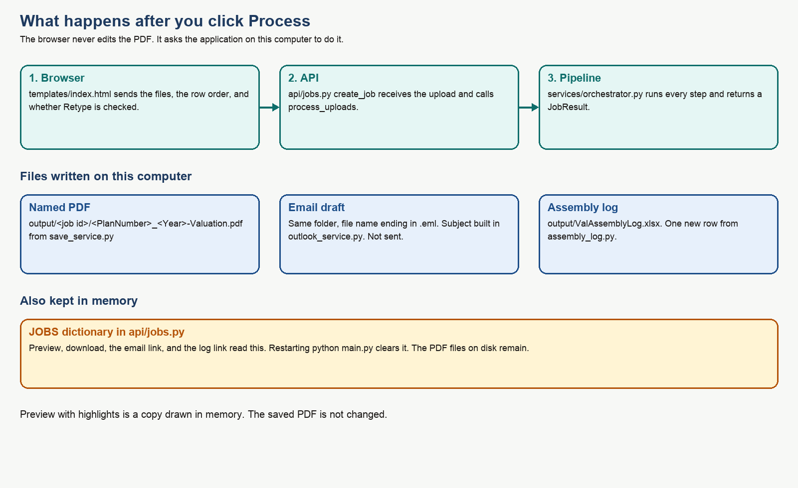
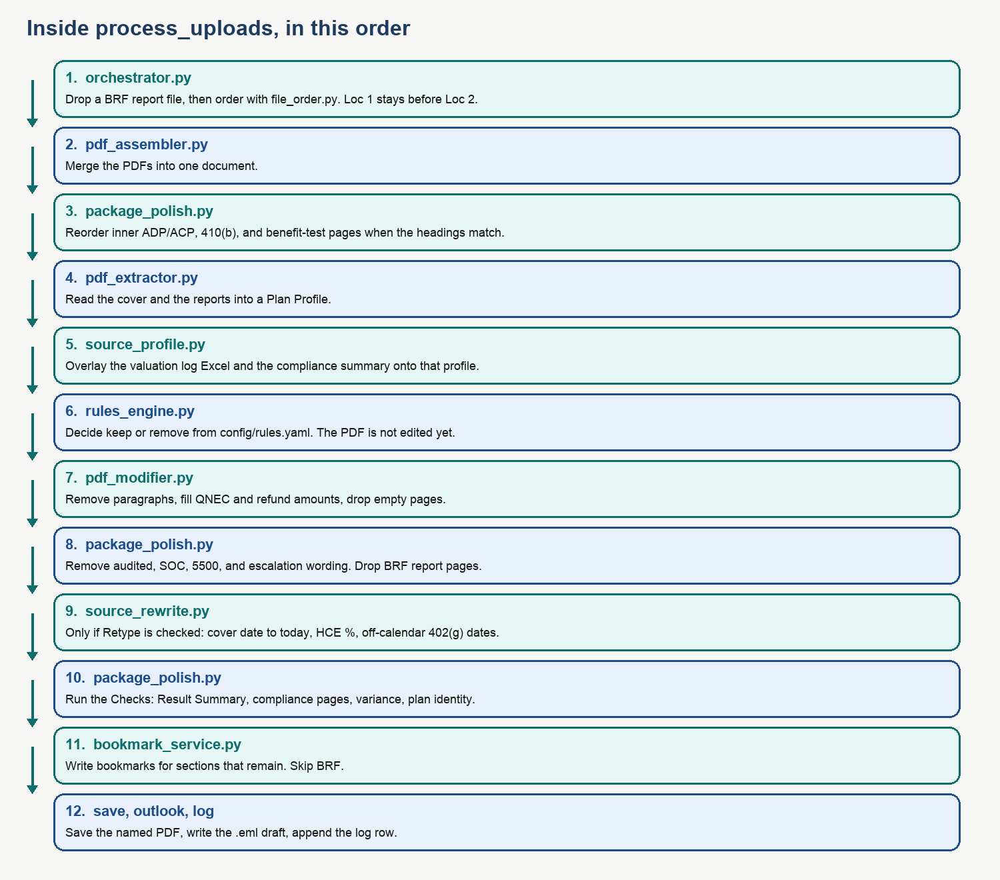

# MOA Valuation Package — Developer Guide

**For:** walking through the code in a demo  
**Date:** 5 October 2026  
**Code:** the application in `new-app/`

This guide matches the code as it runs today. If a slide or an older note disagrees with a file named here, open the file. The file is what the demo is running.

The business rules came from the requirements document (`POC/TEST23.docx`, and the later client update `new-app/TEST23 (1).docx`). This guide does not repeat every business sentence. It tells you which file answers the question.

---

## 1. Start it, and what to say if it will not start

From `new-app`:

```bash
source .venv/bin/activate
python main.py
```

On this Mac there is no `python` command until the virtual environment is active. If the prompt does not show `(.venv)`, use:

```bash
.venv/bin/python main.py
```

Open **http://127.0.0.1:8002**. That page is `templates/index.html`. It is not a separate frontend project.

Restart `python main.py` after any Python change. Hard-refresh the browser after a change to `index.html`.

| Setting | Default | What it changes |
|---|---|---|
| `MOA_PORT` | `8002` | The URL port |
| `MOA_HOST` | `127.0.0.1` | This computer only |
| `MOA_OUTPUT_DIR` | `new-app/output` | Where the PDF and `ValAssemblyLog.xlsx` are written |

There is no database. A job lives in the `JOBS` dictionary in `api/jobs.py` until the process stops. The PDF on disk remains after a restart. The in-memory preview link does not.

---

## 2. The path from the button to the files



Say this if someone asks how the screen talks to the code:

1. `templates/index.html` builds a form and POSTs it to `/api/jobs`.
2. `api/jobs.py`, function `create_job`, reads the files and calls `process_uploads`.
3. `services/orchestrator.py`, function `process_uploads`, does the work and returns a `JobResult`.
4. `create_job` stores that result in `JOBS` and sends it back as JSON. The page then fills Checks, rules, preview, and the download links.

The browser does not merge PDFs. PyMuPDF does, inside the Python process.

---

## 3. If they ask “where is that in the code?”

| They ask about | Open this |
|---|---|
| The page, the buttons, the preview checkbox | `templates/index.html` |
| Upload, folder path, Process, download, preview, log link | `api/jobs.py` |
| The order of every processing step | `services/orchestrator.py` → `process_uploads` |
| Filename keywords and Loc 1 / Loc 2 | `config/sections.yaml` and `services/file_order.py` |
| Splitting a 15-page cover into named rows | `services/pdf_pages.py` and `should_split_pages` in `file_order.py` |
| Merging PDFs | `services/pdf_assembler.py` → `merge_pdfs` |
| Reading plan number, dates, pass/fail from the PDF | `services/pdf_extractor.py` → `extract_plan_profile` |
| Reading the valuation log Excel | `services/source_profile.py` → `parse_excel` |
| The object every rule reads | `models/plan_profile.py` → class `PlanProfile` |
| Keep or remove | `config/rules.yaml` then `services/rules_engine.py` → `evaluate` |
| Actually deleting a paragraph or filling a dollar amount | `services/pdf_modifier.py` |
| BRF left out, inner page order, banned wording, the new checks | `services/package_polish.py` |
| Cover date, HCE %, 402(g) dates | `services/source_rewrite.py` → `apply_source_rewrites` |
| Yellow preview marks | `services/change_marks.py`. Preview endpoint is `preview_job_pdf` in `api/jobs.py` |
| Bookmarks | `services/bookmark_service.py` → `add_bookmarks` |
| Social Security number flag | `services/ssn_scan.py` |
| File name `{plan}_{year}-Valuation.pdf` | `services/save_service.py` → `valuation_filename` |
| Outlook draft | `services/outlook_service.py` → `email_subject` and `write_draft` |
| Assembly log columns | `services/assembly_log.py` → `build_log_row` |
| Mutual of America stamp | `services/logo_check.py` |
| Cover checks that are not the new package checks | `services/review_service.py` → `validate` |

Do not look in `backend/`, `frontend/`, `electron/`, or the root `pdf-process.py`. Those are the old proof of concept. This application does not call them.

---

## 4. Inside Process, in order



`process_uploads` in `services/orchestrator.py` is the function to scroll while you talk. The steps below are that function, in order.

**1. Split uploads.** PDFs stay in the package. `.xlsx` files are the valuation log and are not merged into the PDF. A PDF whose text contains “compliance testing summary of results” is read for pass/fail and is not added as an extra report.

**2. Drop a BRF report file.** `package_polish.exclude_brf_uploads`. The Result Summary line can stay. The BRF report file does not go into the merge. If every file was a BRF report, Process stops with an error.

**3. Order.** If Auto-order is on, `file_order.order_uploads` sorts by `sections.yaml`. The longest keyword wins, so `SHMaVar` is Compensation Limit and not a normal variance file. Files named Loc 1 sort before Loc 2 inside the same section. Unknown names sort last. If Auto-order is off, the list on screen is the order.

**4. Merge.** `pdf_assembler.merge_pdfs`. One PyMuPDF document. Encrypted PDFs and empty files are rejected.

**5. Inner pages.** `package_polish.reorder_inner_pages`. Only a run of pages with matching headings is reordered.

- ADP/ACP: Summary, Detail, Excluded, Corrections
- 410(b): Detail, Excludable, Includable, Summary
- Component benefit test: Average Benefit Percentage, 401a1 Comp, Gateway, Overall Comp, Rate Group, Sum Comp

A page that does not carry one of those headings is left where it is.

**6. Read the PDF.** `pdf_extractor.extract_plan_profile` fills a `PlanProfile` from the cover and the rest of the text. Patterns live in `config/field_patterns.py`. If an ADP/ACP Test Results page does not say Prior Testing, the method is set to CURRENT.

**7. Overlay Excel and the summary.** `source_profile.parse_excel` and `parse_summary_text`, then `merge_overlays`. Excel wins for the fields it contains, because the overlay is applied after the PDF read. The allocation Yes/No and the notes text become `contributions_required` and `assembly_notes`.

**8. Finish a few derived flags.** `plan_profile_service.finalize_profile`. Example: top heavy is true when the percent is 60 or more. Excess Summary is kept only for the cases in the requirements.

**9. First checks.** `review_service.validate` checks that plan number, name, company, address, and year were found, and checks the stamp. These are the cover rows on the Checks tab. The later checks are added in step 14.

**10. Rules, still not editing.** `rules_engine.evaluate` reads `config/rules.yaml`. Each rule becomes keep, remove, or skipped. Skipped means a required fact was missing, so the code refuses to guess. The PDF is unchanged at this moment. You can point at the Rules tab: that JSON is this list.

**11. Edit the PDF.** `pdf_modifier.apply_decisions` redacts a paragraph whose rule said remove, pulls the leftover text up, and deletes a page that is empty afterward. `apply_recap_bullets` does the same for Year End Recap bullets. `fill_qnec_placeholders` types the QNEC and refund amounts and drops an ADP or ACP line that has no amount.

**12. Wording that must not ship.** `package_polish.remove_disallowed_wording` removes a line that says escalation, Form 5500, audited wording, or Statement of Contribution, and deletes a Statement of Contribution page. `drop_brf_pages` deletes a page whose heading is the BRF report. A Result Summary that merely mentions BRF is kept.

**13. Optional retype.** Only when the checkbox was posted as `rewrite_sources=true`. `source_rewrite.apply_source_rewrites`:

- Cover letter date becomes today, for example `October 5, 2026`. A zero-padded day is included in that, because today is written without a leading zero.
- HCE % is calculated only when testing method is PRIOR and an NHCE % was found. Under 2% times 2. From 2% up to but not including 8%, plus 2. 8% or more times 1.25.
- 402(g) dates change only when the plan year does not end on 31 December, and only on a page that contains “402”. The calendar year is the year before the plan year end. A 6/30/2026 year end becomes 01/01/2025–12/31/2025. The saved file name still uses the beginning plan year from the cover.

If the box is unchecked, this function is not called. The Checks tab still says the cover date is not today.

**14. Refresh sections and run the new checks.** `pdf_extractor.detect_sections` runs again because pages may have been deleted. `package_polish.package_checks` adds the Result Summary, compliance-page count, variance, BRF-omitted, cover-date, and plan-identity rows.

**15. Bookmarks.** `bookmark_service.add_bookmarks`. Titles come from the `bookmarks:` block in `sections.yaml`. A 403(b) plan uses **HCE** and **ACP Test**. Other plans use **HCE/Key**, and **ADP Test**, **ACP Test**, or **ADP/ACP Tests** depending on which test files are present. BRF is skipped even if a section was detected. Old bookmarks are replaced by `set_toc`.

**16. Social Security numbers.** `ssn_scan.scan_ssns` looks for `XXX-XX-XXXX` and ignores an EIN pattern. A hit is a failed check. The digits are not removed.

**17. Save.** `save_service.save_package` writes `output/<job id>/<plan number>_<beginning year>-Valuation.pdf`. Missing number or year becomes the word UNKNOWN. If the source path is a Valuation Package folder, a second copy is written in the parent Testing folder.

**18. Email draft.** `outlook_service.write_draft` writes `<same name>.eml` beside the PDF. Subject is exactly `MOA | {plan number} | {plan name} | PYE {plan year end}`. To is empty. Nothing is sent.

**19. Log.** `assembly_log.append_row` opens `output/ValAssemblyLog.xlsx` (or `MOA_OUTPUT_DIR` if that variable is set) and appends one row. Column details are in section 8.

The function then puts warnings on the result: what was removed, what was kept, how many bookmarks, the email subject. Those warnings are the Notes area on the page.

---

## 5. The screen, and the request behind each control

| Control | Request | Code |
|---|---|---|
| Show files, after a folder path | `GET /api/folder?path=...` | `list_source_folder` |
| After you drop files, before Process | `POST /api/inspect` | `inspect_uploads` returns page counts, split labels, and keyword rank |
| Auto-order | form field `auto_order` | `true` or `false` into `process_uploads` |
| Retype cover date to today, 402(g) dates, and HCE % | form field `rewrite_sources` | default false |
| Process package | `POST /api/jobs` | `create_job` |
| Preview | `GET /api/jobs/{id}/preview?highlight=1` or without `highlight` | `preview_job_pdf` |
| Download PDF | `GET /api/jobs/{id}/pdf` | `download_job_pdf` — never paints highlights |
| Assembly log link | `GET /api/jobs/{id}/log` | `download_assembly_log` |
| Email draft link | `GET /api/jobs/{id}/email` | `download_job_email` |

Highlight marks are rectangles drawn on a copy of the PDF in `change_marks.apply_highlights`. The copy is not saved over the real file. Marks are also stored in `highlights.json` next to the PDF so a preview can be rebuilt after the in-memory job is gone, as long as you still have the job id path.

---

## 6. Plan Profile — the one object the rules use

Class `PlanProfile` in `models/plan_profile.py`. If a demo question is “how does it know the plan failed ADP?”, the answer is this object, not a second read of the PDF at rule time.

| Field | Meaning |
|---|---|
| `plan_number`, `plan_name`, `company_name`, `company_address` | Cover, unless the Result Summary or Excel overlay replaced them |
| `plan_year_start`, `plan_year_end`, `beginning_plan_year` | The file name uses `beginning_plan_year` only |
| `plan_type` | `401k` or `403b`. Bookmarks use this |
| `testing_method` | `PRIOR` or `CURRENT` |
| `adp_failed`, `acp_failed`, `fail_402g`, `fail_415` | True, false, or unknown |
| `fail_402g_after_deadline` | The 15 April note was found |
| `returns_required`, `returns_already_processed`, `adp_reclassified` | Whether a letter or notice should stay |
| `after_12_months` | Chooses the after-12-month wording |
| `top_heavy_percent`, `top_heavy` | Percent, and true when it is 60 or more |
| `hce_current`, `hce_future` | From the PDF or from the Excel log |
| `variance_report`, `contributions_required`, `assembly_notes` | Variance paragraph, contributions paragraph, and the log’s allocation note |
| `adp_qnec`, `acp_qnec`, `deferral_refund`, `match_refund`, `total_qnec` | Amounts typed onto the notice |
| `partially_vested`, `keep_excess_summary` | Excess Summary |
| `safe_harbor`, `catchup_disallowed`, `per_payroll_match` | Recap bullets |
| `detected_sections` | Section name and page, used for bookmarks and “is this test in the package?” |
| `moa_logo_found`, `mentions_moa` | Stamp check |

Unknown is stored as `None`. A rule that needs that field and finds `None` is **skipped**, not silently treated as pass or fail.

---

## 7. Rules — open `config/rules.yaml`

`rules_engine.evaluate` does not contain the business sentences. It only checks `keep_when` against the Plan Profile. To change when a paragraph stays, edit the YAML. The heading text that must be found on the page is in `config/paragraphs.yaml`. Both have to match: the YAML decision, and a heading the PDF modifier can search for.

| Id | What it keeps when the condition is true | Otherwise |
|---|---|---|
| A | Compliance-failure paragraph: returns required, and 402(g) or 415 failed, and not past the 15 April note | Remove |
| B | PRIOR ADP/ACP wording, returns required, a test failed, and it was not fixed by reclassification | Remove |
| C | CURRENT ADP/ACP wording, returns required, a test failed | Remove |
| D | After 12 months, CURRENT | Remove |
| E | After 12 months, PRIOR | Remove |
| F | Top heavy percent is 60 or more | Remove |
| G | No immediate action. Kept only when nothing else required action | Remove |
| H | A variance report is present | Remove |
| I | CURRENT failure notice inside 12 months | Remove. PRIOR inside 12 months does not get this notice |
| J_ADP | ADP sample letter: ADP failed and returns required | Remove |
| J_ACP | ACP sample letter: ACP failed and returns required | Remove |
| K | 402(g) letter: failed, returns required, not past 15 April | Remove |
| L | 415 letter: the plan failed 415 | Remove |
| M | Contributions / true-up wording | Remove |
| ES | Excess Summary | Remove |
| Y1–Y8 | Year End Recap bullets (no HCE, PRIOR, CURRENT, Safe Harbor, HCE with no future HCE, catch-up, top heavy, per-payroll match) | Remove that bullet |

Compensation Limit has no Action Required rule. The file can be in the package. The log column Failed Comp Limit is always N/A.

---

## 8. The assembly log

`assembly_log.build_log_row` fills one row. Headers are row 1. Row 2 column E says “Allocation Completed”. Data starts at row 3.

| Column | Value |
|---|---|
| Omni Plan Number, Plan Name | Result Summary text if that page was found, otherwise the Plan Profile |
| Future HCE | Yes if the Excel future-HCE answer is Yes or the Future HCE report lists a person. No if the answer is No |
| Current-year HCE | Same idea, from the current-HCE answer and the HCE/Key report |
| Allocation | Annual-Var if the note says annual allocation and true-up were both done. Annual if the note says annual allocation only. Variance with a cell note `0.00 variance` if the note says true-up and no variance. Variance if allocation was Yes and the note is not more specific. Blank if allocation was not Yes |
| ADP/ACP, 402(g), 410(b), ABP, 414(s), 401(a)(4), 415, BRF | F if that test failed. P if it passed. N/A if the plan does not have that test. Either ADP or ACP failing is F |
| Top Heavy | Yes or No from “Plan is / is not Top Heavy”, or from the profile |
| Failed Comp Limit | N/A |
| FIS, related plans, MEP, safe harbor | Blank. The client sheet says the tester fills these |

This file is not the Testing Log. The Testing Log is the shared workbook where a person types their name before anyone starts. There is no code that opens that workbook.

---

## 9. Bookmarks, in one minute

`add_bookmarks` builds a table of contents and calls `doc.set_toc`. One entry per remaining section. Page numbers are the pages after removals, because sections are detected again at step 14.

Say this if they ask about 403(b): plan type contains `403`, so the HCE bookmark is **HCE** and the test bookmark is **ACP Test**. A 401(k) file named like an ADP-only report becomes **ADP Test**. A file that is both ADP and ACP becomes **ADP/ACP Tests**. A cover line such as `ADP Test: Fail` does not by itself create the ADP bookmark. A real ADP heading or an ADP file name does.

---

## 10. What you should not claim in the demo

| Topic | The honest sentence |
|---|---|
| Testing Log | We do not write the reviewer’s name into the shared testing workbook. |
| Email | We write a draft. We do not send it. |
| Non-PDF | Word, Excel, and pictures are skipped. Excel is read only when it is the valuation log, not converted into a PDF page. |
| Scanned PDF | If the page is only a picture, extraction finds nothing. The merge still happens. Rules, bookmarks, the file name, and the log stay empty. |
| Other company names | The stamp check can pass and another company name can still be on the cover. That second look is visual. |
| Three compliance pages | We count them and flag a different count. We do not create the missing pages. |
| Variance page layout | We report name order, font size, zeroes, and text at the edge. We do not retype that page. |
| Tester log columns | FIS, related plans, MEP, and safe harbor are left blank on purpose. |
| Highlights | They exist only on the preview response. Download reads the saved file. |

---

## 11. Config files

| File | Edit this when |
|---|---|
| `config/sections.yaml` | A new filename should sort into a section, or a bookmark title changes |
| `config/rules.yaml` | The condition for keep or remove changes |
| `config/paragraphs.yaml` | The heading text on the PDF does not match what we search for |
| `config/field_patterns.py` | A plan number or a pass/fail line is printed in a new shape |
| `config/settings.py` | Port, output folder, upload size limit (50 MB per file, 80 files) |

`config/package_map.yaml` is an older map of the same business areas. The live order is `sections.yaml`. The live rules are `rules.yaml`.

---

## 12. Tests that prove a sentence

Run from `new-app` with the virtual environment active:

```bash
python -m pytest -q
```

| If they ask | Run or open |
|---|---|
| Order, folder path, SHMa versus variance | `tests/test_folder_and_order.py` |
| ADP Test versus ACP Test bookmarks | `tests/test_bookmarks.py` |
| Cover date, HCE table, 402(g) year, highlights not on the download | `tests/test_source_rewrite.py` |
| Excel CURRENT, summary pass/fail | `tests/test_excel_summary_paragraphs.py` |
| Variance, excess, recap, log file exists | `tests/test_remaining_sop.py` |
| New client items: locations, BRF, inner pages, banned wording, log columns | `tests/test_client_updates.py` |

---

## 13. A short demo script you can keep beside you

1. “The page is one HTML file. Process posts to `/api/jobs`.”
2. “`create_job` calls `process_uploads`. That function is the whole pipeline.”
3. “We merge first, then read a Plan Profile. Rules look only at that object.”
4. “`rules.yaml` says keep or remove. `pdf_modifier.py` is what changes the PDF.”
5. “Retype is off unless the box is checked. Highlights are a preview copy.”
6. “We save the named PDF, an `.eml` draft, and one log row. We do not send mail, and we do not sign the Testing Log.”
